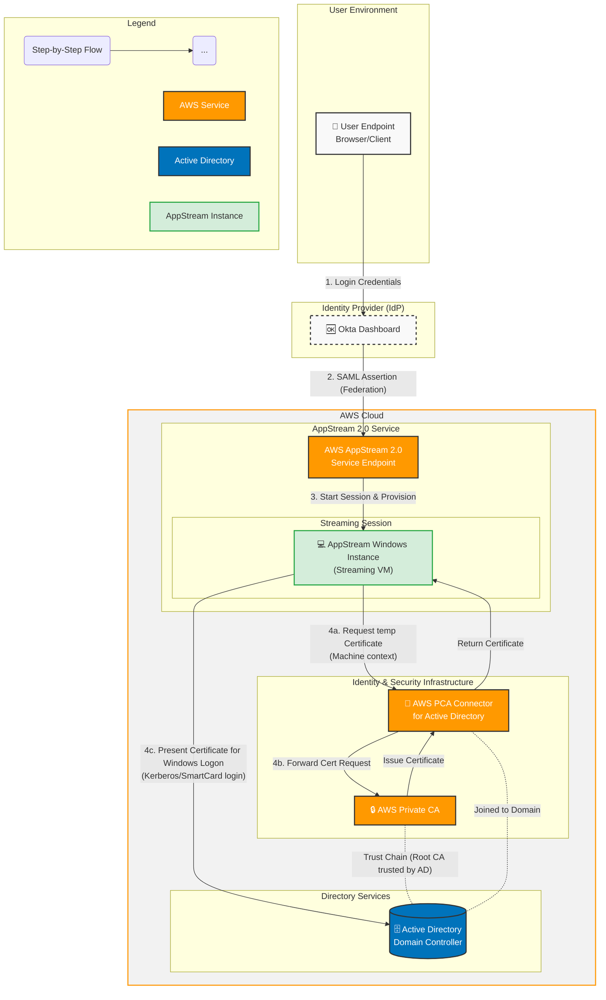

---
tags:
type:
date: 2026-01-02
done: false
---
**Lets keep the language natural. So far what I understand is, The identity lives in AD and synced with OKTA. The users authenticates with the identity with okta. And Okta issues a SAML assertion back to user, user passes the SAML to aws idp config, and idp verifies the SAML trust establishment and then IdP gives you the assume role session, you get to access appstream fleet. Now my question is what is the need for password now, for AD joined instances?**

**Correction (important):**  
Okta does **not** issue anything to the user.  
Okta issues a **SAML assertion directly to AWS**. The user never “carries” it.

- **Okta ≠ AD authentication replacement**
    - Okta authenticates the user **to AWS/AppStream**.
    - It does _not_ authenticate the user **to AD**.
    - No Kerberos, no NTLM, no LDAP bind happens via Okta.
        
- **AppStream sessions are AD-backed**
    - The fleet is **domain joined**.
    - The session runs under an **AD user context**.
    - AD requires a **password-derived secret** to issue Kerberos TGTs.

- **How login actually works**
    - Okta → AWS → AppStream decides _who is allowed in_.
    - AppStream then maps that identity to an **existing AD user**.
    - AppStream logs in the user using **AD credentials** behind the scenes.

